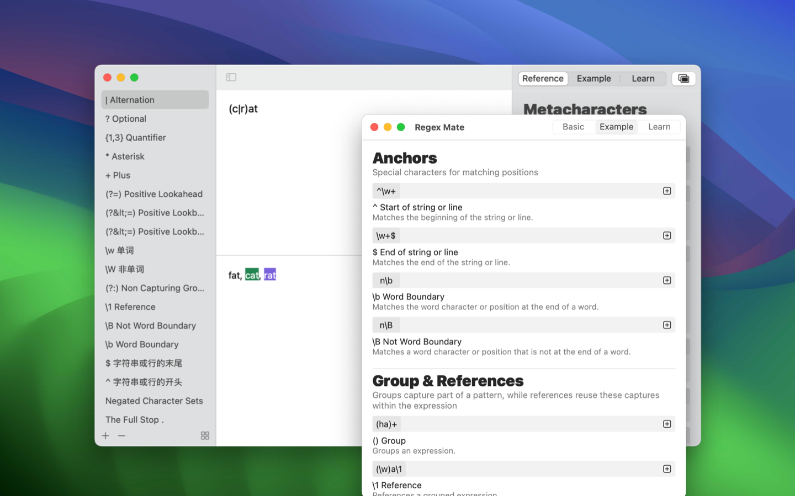

	 
	 
	
  

		<a href="./README.zh.md">中文</a> • 
    <a href="https://apps.apple.com/app/regex-mate/id6479819388">AppStore</a> • 
		<a href="https://wangchujiang.com/#/contact">Contact & Support</a>
  

	<h1>RegexMate</h1>
  <!--rehype:style=border: 0;-->
  

    
  

RegexMate is a beautifully designed regex app built exclusively for macOS. With a clean and intuitive interface, it empowers you to craft and test regular expressions with ease.

### Key Features:

#### Minimalist UI

Forget buttons and menus. Simply type your pattern, test your expression, and see the results instantly.

#### Reference Table

An always-available reference guide with example tutorials in both English and Chinese. Never forget regex syntax again!

#### Live Preview

See your results update as you type. Input your pattern and watch the results, modify and test your expression to check its validity.

#### Expression Library

Save your frequently used expressions for quick access and reference at any time.

#### Light & Dark Mode

Love the dark aesthetic? RegexMate has you covered. But if you're craving a fresh look, switch to Light mode anytime.
