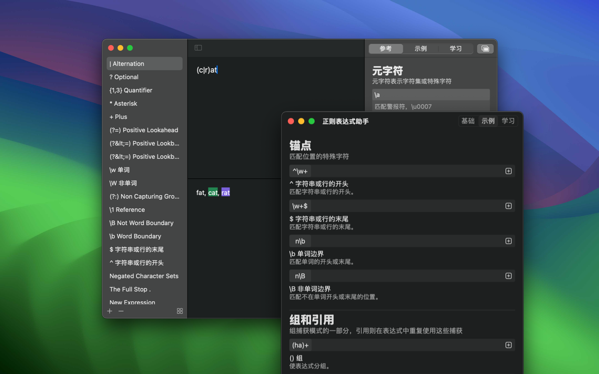
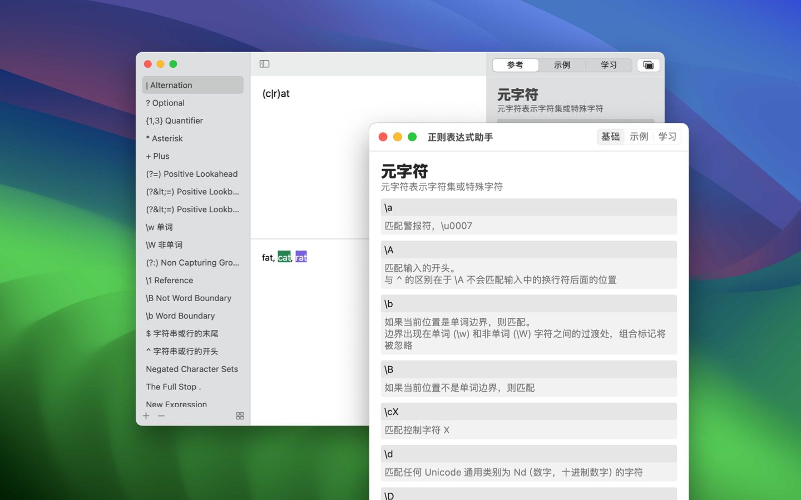

	 
	 
	
	<h1>RegexMate</h1>
  <!--rehype:style=border: 0;-->
  

		<a href="./README.md">English</a> • 
    <a target="_blank" href="https://apps.apple.com/app/regex-mate/id6479819388">AppStore</a> • 
		<a target="_blank" href="https://wangchujiang.com/#/contact">联系&支持</a> • 
    <a href="https://github.com/jaywcjlove/regex-mate/releases">变更日志</a>
  

  

    
    
  

RegexMate 是一款正则表达式应用程序，支持 macOS 和 iOS 平台。它拥有简洁的用户界面和强大的功能，能够帮助用户轻松地创建、测试和使用正则表达式。

### 主要特点

#### 简约的用户界面

忘记按钮和菜单吧。只需输入您的模式，测试表达式，即可立即查看结果。

#### 参考表

始终可用的参考指南，提供中英文示例教程。再也不用担心忘记正则表达式语法了！

#### 实时预览

随着您的输入，立即看到结果更新。输入您的模式并观察结果，修改并测试您的表达式以检查其有效性。

#### 表达式库

保存您经常使用的表达式，随时快速访问和参考。

#### 浅色和深色模式

喜欢暗色调？RegexMate 应用程序满足您的需求。但如果您想要焕然一新的外观，随时切换到浅色模式。
